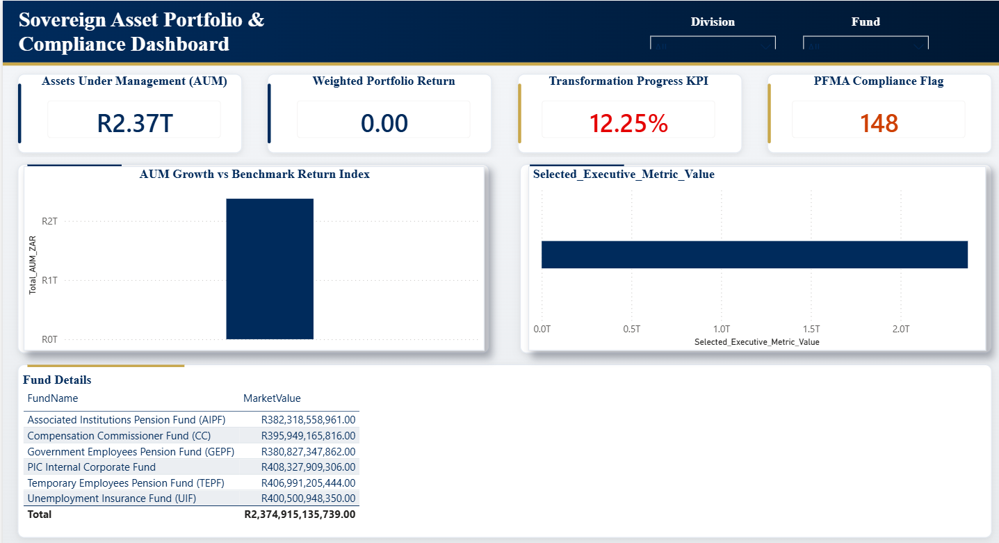

# Sovereign Portfolio Analytics — Power BI Enterprise Showcase

A production-ready Power BI Enterprise Showcase designed for South Africa's sovereign asset manager overseeing ~R2.7 trillion AUM. 

This project is engineered to focus on visual storytelling, user experience, and alignment with a sovereign asset manager's requirements (demonstrating Fabric DirectLake readiness, sophisticated star-schema design, advanced statistical DAX, object-level security, and performance discipline).

---

## 📸 Dashboard Preview

---

## 🌟 Key Highlights
* **DirectLake Ready Star Schema:** 9 Dimension tables and 8 Fact tables, fully configured with structured PK/FK relationships.
* **33 Advanced DAX Measures:** Includes financial metrics (Cost-to-Income, YTD Variance), risk indicators (Sharpe Ratio, tracking error, 95% 1-day VaR), unlisted asset metrics (XIRR approximation, MOIC, DPI), and operational KPIs (SLA compliance, settlement failure rates).
* **Enterprise Security (RLS + OLS):** Dynamic row-level security (RLS) filtering by division/manager email, coupled with object-level security (OLS) protecting sensitive salary and demographic fields.
* **F-Pattern Page Layouts:** Premium corporate styling using PIC Navy (`#002B5C`) and Gold (`#C9A84C`) palette.
* **South African Compliance Focus:** Incorporated PFMA non-compliance counters, B-BBEE skills spend metrics, and Level 1–4 BEE brokerage allocations.

---

## 📂 Repository Structure

* [sql scripts/](sql%20scripts/)
  * [initialise_db.sql](sql%20scripts/initialise_db.sql) - Database schema generation script (DDL + basic seeds).
  * [expand_seed_data.sql](sql%20scripts/expand_seed_data.sql) - Seed script generating realistic demographic distributions and 5,000 transaction rows per fact table.
* [PBI/](PBI/)
  * [invest.pbip](PBI/invest.pbip) - The Power BI project file shell.
  * `invest.Report/` - Report definition folder containing layout, theme, and visuals.
  * `invest.SemanticModel/` - TMDL semantic model definition folder containing the dataset schema, tables, and security policies.
* [DAX/](DAX/) - Individual version-controlled text files for each of the 36 measures.
* [project_docs/](project_docs/)
  * [PORTFOLIO ARCHITECTURE.md](project_docs/PORTFOLIO%20ARCHITECTURE.md) - Deep architectural and design spec.
  * [Project Brief Extended.md](project_docs/Project%20Brief%20Extended.md) - Project goals, design constraints, and core directives.
  * [TableRelationship Matrix.md](project_docs/TableRelationship%20Matrix.md) - Logical modeling and mapping documentation.
  * [data_dictionary.md](project_docs/data_dictionary.md) - Enterprise data dictionary detailing keys, descriptions, and data types.
  * [measure_catalogue.md](project_docs/measure_catalogue.md) - Catalog of all 33+ core and operational measures.
  * [report_visualisation_layout_blueprint.md](project_docs/report_visualisation_layout_blueprint.md) - UI design specs, grid structures, and navigation paths.
  * [requirements_log.md](project_docs/requirements_log.md) - Stakeholder requirements, functional/non-functional needs, and security rules.
  * [user_guide.md](project_docs/user_guide.md) - Quick reference guide and report usage instructions for end-users.

---

## 📊 Star Schema Data Model

The project builds a complete Star Schema to model PIC's corporate and portfolio structures:

### Dimension Tables (9)
* **`Dim_Date`**: Full calendar table supporting South African public holidays and April fiscal year starts.
* **`Dim_Division`**: 10 distinct corporate units (e.g. Listed Equities, Fixed Income, Properties).
* **`Dim_Employee`**: 403 employees containing SA demographic fields (Gender, Ethnic Group, HDI, Salary). *Access is restricted via Object-Level Security.*
* **`Dim_Fund`**: 6 primary fund mandates (e.g., GEPF, UIF, AIPF).
* **`Dim_InvestmentAsset`**: 50 assets across listed equities, corporate bonds, unlisted PE, and real estate.
* **`Dim_AuditCategory`**: 10 classifications representing Auditor-General and Internal Audit focus areas.
* **`Dim_RegulatoryBody`**: FSCA, National Treasury, SARB.
* **`Dim_BEELevel`**: Standard BBBEE Recognition percentages.
* **`Dim_DynamicMetricControls`**: Disconnected table for dynamic metric switching in the Executive Overview.

### Fact Tables (8)
* **`Fact_FinancialTransactions`**: Daily actual and budget amounts (5,000 rows, PFMA compliance codes).
* **`Fact_HREvents`**: Headcount events, exit tracking, and skills development spend.
* **`Fact_TradeSettlements`**: Listed securities trading metadata, fee allocations, and settlement failures.
* **`Fact_AuditFindings`**: Risk assessment tracker of raised vs closed audit findings.
* **`Fact_ProjectMilestones`**: IT system migration tracking (Fabric migration, SAP upgrade, Data Quality index).
* **`Fact_PortfolioReturns`**: Daily asset returns and benchmark indices.
* **`Fact_UnlistedInvestments`**: Vintage performance, capital drawdowns, and PE valuations.
* **`Fact_HelpdeskTickets`**: SLA compliance logs and support ticket queues.

---

## 🛠️ Step-by-Step Deployment Instructions

To reproduce the database environment and Power BI dataset:

### Step 1: Initialize the Database
1. Connect to your SQL Server / Fabric SQL Database instance and create a database named `InvestmentHouse_db`.
2. Execute [initialise_db.sql](sql%20scripts/initialise_db.sql) to build out the schemas and table relationships.

### Step 2: Seed the Data
1. Execute [expand_seed_data.sql](sql%20scripts/expand_seed_data.sql) in your query window.
2. This script seeds all dimensions and populates exactly 5,000 rows per fact table with realistic South African distributions (African: ~65%, HDI representation, budget variances, BEE brokerage allocations, etc.).

### Step 3: Open the Power BI Shell
1. Open [invest.pbip](PBI/invest.pbip) in Power BI Desktop (ensure that the latest Power BI version supporting PBIP is installed).
2. Configure your Data Source Settings to point to your deployed SQL Server instance or Fabric Warehouse endpoint.

---

## 📈 Enterprise DAX Library Highlights
All measures are version-controlled and saved inside [DAX/](DAX/). Key patterns demonstrated include:

* **Time Intelligence:** YoY Operational Budget Variance, Rolling 12-Month OPEX.
* **Portfolio Risk Statistics:** Annualized Tracking Error, Sharpe Ratio, and 95% 1-Day Value-at-Risk (VaR).
* **Private Equity Operations:** Multiple on Invested Capital (MOIC), Distributions to Paid-In Capital (DPI), and Net Asset Value (NAV) IRR approximation.
* **Governance & SLA Compliance:** SLA resolution rates, regulatory penalty/breach counters.
* **Transformation Dynamics:** Weighted ESG scores, B-BBEE scorecard points, and dynamic gender/HDI alignment metrics.
